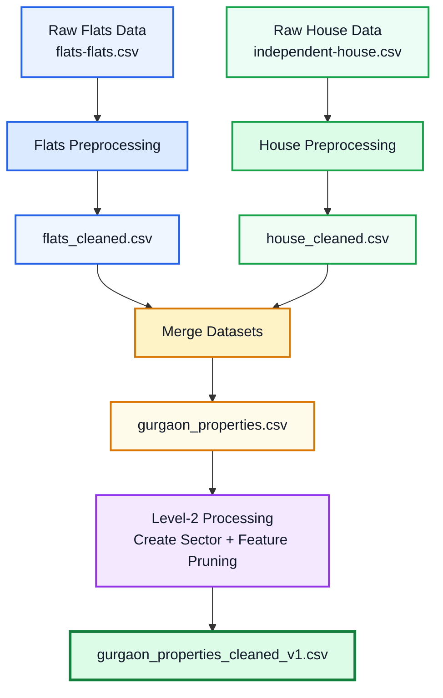

## 🛠️ Data Preprocessing

The raw 99acres property listings were cleaned, standardized, and transformed into a structured Gurgaon real-estate dataset.

### Processing Workflow


## ⚙️ Feature Engineering

The cleaned Gurgaon property dataset was further transformed to extract meaningful property, furnishing, and amenity-level features.

### Key Steps

### 1. Area Features
- Extracted `super_built_up_area`, `built_up_area`, and `carpet_area` from `areaWithType`
- Converted area values from sq.m. to sq.ft. where required
- Extracted plot area for plot properties

### 2. Additional Room Features
- Converted `additionalRoom` into binary features:
  - `study room`
  - `servant room`
  - `store room`
  - `pooja room`
  - `others`

### 3. Property Age
- Categorized `agePossession` into:
  - `New Property`
  - `Relatively New`
  - `Moderately Old`
  - `Old Property`
  - `Under Construction`
  - `Undefined`

### 4. Furnishing Features
- Extracted individual furnishing information from `furnishDetails`
- Converted furnishing information into numerical features
- Applied K-Means clustering to classify properties into:
  - `Unfurnished`
  - `Semi-furnished`
  - `Furnished`

### 5. Property Amenities
- Filled missing `features` using society-level facility information
- Converted amenities into binary features using `MultiLabelBinarizer`
- Calculated a weighted `luxury_score` based on available amenities

### 6. Final Feature Selection
- Removed redundant raw columns:
  `nearbyLocations`, `furnishDetails`, `features`, `features_list`, `additionalRoom`
- Saved the engineered dataset as:
  `gurgaon_properties_cleaned_v2.csv`


### 📊 Feature Engineering Workflow

```mermaid
flowchart TD
    A["Cleaned Dataset<br/>gurgaon_properties_cleaned_v1.csv"]

    A --> B["📐 Area Engineering<br/>Super Built-up • Built-up • Carpet"]
    A --> C["🏠 Additional Rooms<br/>Study • Servant • Store • Pooja"]
    A --> D["🏗️ Property Age<br/>New • Old • Under Construction"]
    A --> E["🛋️ Furnishing<br/>Feature Extraction + K-Means"]
    A --> F["⭐ Amenities<br/>MultiLabelBinarizer + Luxury Score"]

    B --> G["Feature Integration"]
    C --> G
    D --> G
    E --> G
    F --> G

    G --> H["🧹 Remove Redundant Columns"]
    H --> I["✅ gurgaon_properties_cleaned_v2.csv<br/>"]

    style A fill:#EAF2FF,stroke:#2563EB,stroke-width:2px,color:#111827
    style B fill:#EAF2FF,stroke:#2563EB,stroke-width:2px,color:#111827
    style C fill:#EAF2FF,stroke:#2563EB,stroke-width:2px,color:#111827
    style D fill:#F3E8FF,stroke:#9333EA,stroke-width:2px,color:#111827
    style E fill:#ECFDF5,stroke:#16A34A,stroke-width:2px,color:#111827
    style F fill:#FEF3C7,stroke:#D97706,stroke-width:2px,color:#111827
    style G fill:#FFF7ED,stroke:#EA580C,stroke-width:2px,color:#111827
    style H fill:#F3E8FF,stroke:#9333EA,stroke-width:2px,color:#111827
    style I fill:#DCFCE7,stroke:#15803D,stroke-width:3px,color:#111827
