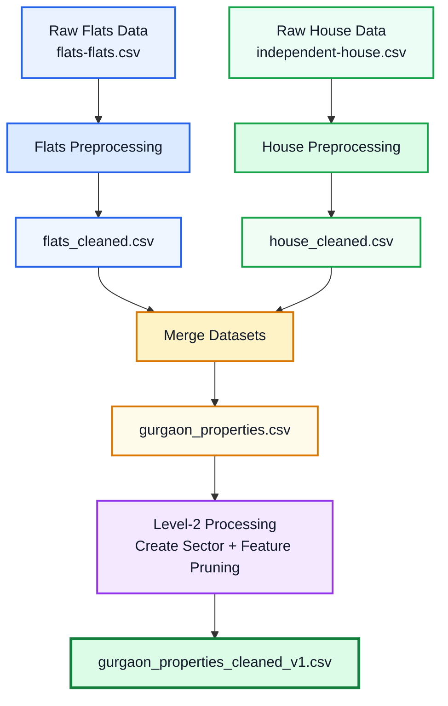
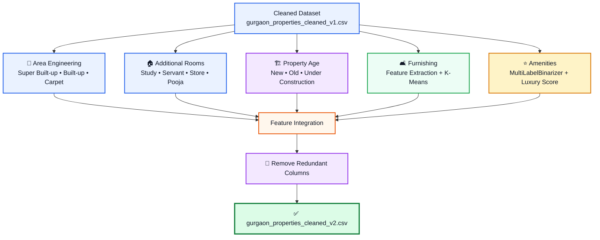

## 🛠️ Data Preprocessing

The raw 99acres property listings were cleaned, standardized, and transformed into a structured Gurgaon real-estate dataset.

### Processing Workflow


## ⚙️ Feature Engineering

The cleaned Gurgaon property dataset was further transformed to extract meaningful property, furnishing, and amenity-level features.

### Key Steps

### 1. Area Features
- Extracted `super_built_up_area`, `built_up_area`, and `carpet_area` from `areaWithType`
- Converted area values from sq.m. to sq.ft. where required
- Extracted plot area for plot properties

### 2. Additional Room Features
- Converted `additionalRoom` into binary features:
  - `study room`
  - `servant room`
  - `store room`
  - `pooja room`
  - `others`

### 3. Property Age
- Categorized `agePossession` into:
  - `New Property`
  - `Relatively New`
  - `Moderately Old`
  - `Old Property`
  - `Under Construction`
  - `Undefined`

### 4. Furnishing Features
- Extracted individual furnishing information from `furnishDetails`
- Converted furnishing information into numerical features
- Applied K-Means clustering to classify properties into:
  - `Unfurnished`
  - `Semi-furnished`
  - `Furnished`

### 5. Property Amenities
- Filled missing `features` using society-level facility information
- Converted amenities into binary features using `MultiLabelBinarizer`
- Calculated a weighted `luxury_score` based on available amenities

### 6. Final Feature Selection
- Removed redundant raw columns:
  `nearbyLocations`, `furnishDetails`, `features`, `features_list`, `additionalRoom`
- Saved the engineered dataset as:
  `gurgaon_properties_cleaned_v2.csv`


### 📊 Feature Engineering Workflow


## 📊 Exploratory Data Analysis

A comprehensive exploratory analysis was performed on the engineered Gurgaon real-estate dataset to uncover **distributional patterns, market structure, feature relationships, and potential pricing drivers**.

### 🔹 Automated Data Profiling

- Generated an automated statistical profile of the dataset.
- Evaluated **data types, missing values, descriptive statistics, distributions, and correlations**.
- Identified data-quality patterns for further analysis.

### 🔹 Univariate Analysis

- Analyzed **property type, society, sector, furnishing, and other categorical features**.
- Examined numerical variables including **price, price per sq. ft., and property area**.
- Investigated **skewness, kurtosis, quantiles, and outliers**.
- Used **histograms, bar plots, box plots, pie charts, and ECDFs**.

### 🔹 Multivariate Analysis

- Studied relationships between **property characteristics and price**.
- Compared pricing across **property type, bedrooms, furnishing, age of possession, and sectors**.
- Analyzed **area vs. price** and **luxury score vs. price**.
- Performed **correlation analysis** to identify relationships among numerical features.
- Used **scatter plots, box plots, grouped comparisons, pair plots, and correlation heatmaps**.

### 🔹 Key Insights

- Identified **market composition and category concentration** across property types and societies.
- Detected **skewed distributions and potential outliers** in pricing and area variables.
- Examined the influence of **property size, location, configuration, furnishing, and luxury characteristics** on pricing.
- Established the analytical foundation for subsequent **property-price visualization and insight generation**.

### 📈 EDA Workflow

```mermaid
flowchart LR
    A["📊 Engineered Dataset"]
    --> B["🔎 Automated Profiling"]
    --> C["📈 Univariate Analysis"]
    --> D["🔗 Multivariate Analysis"]
    --> E["💡 Insights & Patterns"]

    style A fill:#EAF2FF,stroke:#2563EB,stroke-width:2px,color:#111827
    style B fill:#ECFDF5,stroke:#16A34A,stroke-width:2px,color:#111827
    style C fill:#FEF3C7,stroke:#D97706,stroke-width:2px,color:#111827
    style D fill:#F3E8FF,stroke:#9333EA,stroke-width:2px,color:#111827
    style E fill:#DCFCE7,stroke:#15803D,stroke-width:3px,color:#111827:#9333EA,stroke-width:2px,color:#111827
    style E fill:#DCFCE7,stroke:#15803D,stroke-width:3px,color:#111827
```


## 🎯 Outlier Detection & Treatment

Outliers were systematically identified and treated using **distribution analysis, box plots, IQR-based detection, domain-based thresholds, and feature-consistency checks**.

### 🔹 Price & Price per Sq. Ft.

- Examined distributions and box plots to identify extreme values.
- Used the **IQR method** to detect potential outliers in `price` and `price_per_sqft`.
- Investigated extreme observations individually to distinguish **genuine high-value properties from data errors**.
- Corrected inconsistent `area` and recalculated `price_per_sqft` where required.
- Preserved genuine high-value properties rather than removing them indiscriminately.

### 🔹 Property Area

- Identified unrealistic area values using distribution analysis and domain-based thresholds.
- Removed clearly invalid observations.
- Corrected inconsistent area-unit values.
- Rechecked the distribution after treatment.

### 🔹 Bedroom & Bathroom

- Investigated unusually high bedroom and bathroom counts.
- Applied domain-based constraints to remove implausible bedroom values.
- Verified the resulting distributions after treatment.

### 🔹 Area Consistency

- Created an `area-room_ratio` feature:

```text
Area-to-Room Ratio = Area / Number of Bedrooms
```
### 📊 Outlier Treatment Workflow

```mermaid
flowchart LR

    A["📊 Engineered Dataset<br/>"]
        --> B["🔎 Outlier Detection"]

    B --> C["📈 Distribution Analysis<br/>Histograms + Box Plots"]

    C --> D["📐 Identify Extreme Values<br/>IQR + Domain Rules"]

    D --> E["🔍 Validate Outliers"]

    E --> F["✏️ Correct Data Errors"]
    E --> G["🗑️ Remove Invalid Values"]

    F --> H["🔄 Recalculate Features"]
    G --> H

    H --> I["📊 Post-Treatment Validation"]

    I --> J["✅ Outlier-Treated Dataset"]

    style A fill:#EAF2FF,stroke:#2563EB,stroke-width:2px,color:#111827
    style B fill:#F3E8FF,stroke:#9333EA,stroke-width:2px,color:#111827
    style C fill:#FEF3C7,stroke:#D97706,stroke-width:2px,color:#111827
    style D fill:#FEF3C7,stroke:#D97706,stroke-width:2px,color:#111827
    style E fill:#F3E8FF,stroke:#9333EA,stroke-width:2px,color:#111827
    style F fill:#ECFDF5,stroke:#16A34A,stroke-width:2px,color:#111827
    style G fill:#FEE2E2,stroke:#DC2626,stroke-width:2px,color:#111827
    style H fill:#EAF2FF,stroke:#2563EB,stroke-width:2px,color:#111827
    style I fill:#FFF7ED,stroke:#EA580C,stroke-width:2px,color:#111827
    style J fill:#DCFCE7,stroke:#15803D,stroke-width:3px,color:#111827
```


## 🧩 Missing Value Imputation

Missing values were analyzed and imputed using **feature relationships, property characteristics, and appropriate statistical techniques** while preserving the underlying structure of the real-estate data.

### 📊 Imputation Workflow

```mermaid
flowchart LR

    A["📊 Outlier-Treated Dataset"]
        --> B["🔎 Missing Value Analysis"]

    B --> C["📋 Identify Missing Columns"]

    C --> D["🏢 Property-Level Analysis<br/>Flat vs House"]

    D --> E["🔗 Feature Relationship Analysis"]

    E --> F["📐 Area-Based Imputation<br/>Built-up • Super Built-up • Carpet"]

    F --> G["🏠 Categorical Imputation<br/>Facing • Floor"]

    G --> H["🔄 Validate Imputed Data"]

    H --> I["✅ Complete Dataset"]

    style A fill:#EAF2FF,stroke:#2563EB,stroke-width:2px,color:#111827
    style B fill:#F3E8FF,stroke:#9333EA,stroke-width:2px,color:#111827
    style C fill:#FEF3C7,stroke:#D97706,stroke-width:2px,color:#111827
    style D fill:#ECFDF5,stroke:#16A34A,stroke-width:2px,color:#111827
    style E fill:#F3E8FF,stroke:#9333EA,stroke-width:2px,color:#111827
    style F fill:#DBEAFE,stroke:#2563EB,stroke-width:2px,color:#111827
    style G fill:#DCFCE7,stroke:#15803D,stroke-width:2px,color:#111827
    style H fill:#FFF7ED,stroke:#EA580C,stroke-width:2px,color:#111827
    style I fill:#DCFCE7,stroke:#15803D,stroke-width:3px,color:#111827
```



### 🔹 Key Missing Features

- `society`
- `floorNum`
- `facing`
- `super_built_up_area`
- `built_up_area`
- `carpet_area`

### 📈 Validation

- Checked missing-value counts before treatment.
- Used feature relationships to support area-related imputation.
- Rechecked the dataset after imputation to ensure consistency.
## Feature Selection 
## Baseline Model
## model Selection
## analytics page
## recommender_system
